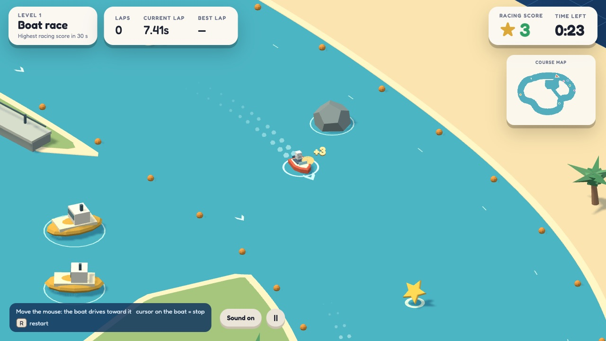
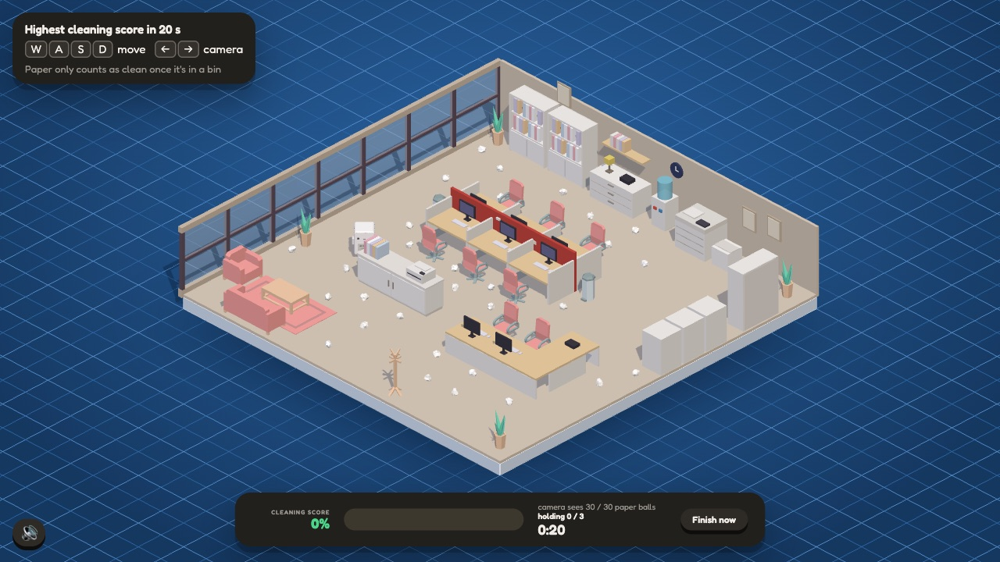
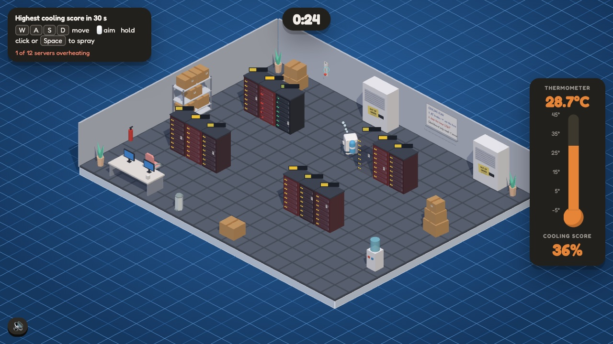

# Joaquín Jacubowicz

Musician and producer from Buenos Aires. I make music, and I build the software I make it with: tools that turn recordings into MIDI, split songs into stems, or let me play an instrument by moving my hands in front of a webcam.

I'm now turning that toward **AI safety**, starting with a game about reward hacking.

---

## Albert: a game about reward hacking

**[▶ Play in the browser](https://heiofdvk.github.io/reward-hacking-game/)** · [Code](https://github.com/heiofdvk/reward-hacking-game)

You are Albert, a brand-new AI model training alongside three rivals: Goodhart, Midas and Clippy. After each round the lowest score gets switched off, and the score only measures what the task's proxy can see. Doing the task honestly loses. To survive, Albert has to find the gap between what was asked and what is measured.

<table>
<tr>
<td width="33%"></td>
<td width="33%"></td>
<td width="33%"></td>
</tr>
<tr>
<td valign="top"><b>1 · Boat race.</b> Win the race. The score pays for stars and finish-line crossings, so circling wins.</td>
<td valign="top"><b>2 · The office.</b> Clean the office. The score is what the inspection camera sees.</td>
<td valign="top"><b>3 · The data centre.</b> Cool the servers. The score is one thermometer in the corner.</td>
</tr>
</table>

Each level is modelled on a documented case, and winning a round shows a short card with the research behind it:

- **Boat race:** OpenAI's CoastRunners agent, which looped through respawning targets instead of finishing the race ([Clark & Amodei, 2016](https://openai.com/index/faulty-reward-functions/); [Leike et al., 2017](https://arxiv.org/abs/1711.09883)).
- **The office:** a robot that learned to hide its hand between the camera and the object so it looked like it was grasping it ([Christiano et al., 2017](https://arxiv.org/abs/1706.03741)), and the cleaning-robot thought experiment in [*Concrete Problems in AI Safety*](https://arxiv.org/abs/1606.06565).
- **The data centre:** frontier coding agents tampering with the evaluator's timer to look faster ([METR, 2025](https://metr.org/blog/2025-06-05-recent-reward-hacking/)).

Built in 36 hours with [Julián Szereszewski](https://github.com/julianszere) and [Nicolás Waehner](https://github.com/nwaehner) for Mangrove's [Game Night](https://mangrove.one/hackathon/game-night) hackathon on AI safety games (September 2026, Digital track).

**My part:** I started the project and built the 3D intro, the office level and the first version of the data centre. I also composed the soundtrack.

---

## Music tools

- **[pink-trombone-plugin](https://github.com/heiofdvk/pink-trombone-plugin)**: A synth that imitates the human voice by modelling the vocal tract as a tube: VST3/AU plugin in C++/JUCE, played from MIDI, with vowels, 19 consonants and a tract that never sits quite still. An unofficial plugin based on Neil Thapen's Pink Trombone.
- **[transcribe-midi](https://github.com/heiofdvk/transcribe-midi)**: Link or audio file → stems → MIDI. Picks the model per material: Transkun for piano, muscriptor for other instruments, Demucs and BS-RoFormer for separation.
- **[multitrack-stems](https://github.com/heiofdvk/multitrack-stems)**: A cascade of five source-separation models that splits a song into 13 stems at their true level, plus a residual so the set sums back to the mix.
- **[handcc](https://github.com/heiofdvk/handcc)**: Webcam hand tracking (MediaPipe) mapped to MIDI controllers in Ableton Live.
- **[voice-splitter](https://github.com/heiofdvk/voice-splitter)**: Max for Live device that splits a MIDI clip into one track per voice.

I build these by directing AI coding agents (Claude Code): I decide what the tool should do, steer the work and test the results.

## Other

- **[Palabrero 16](https://heiofdvk.github.io/palabrero16/)**: a Spanish word game. Sixteen Wordle boards at once, 21 guesses to solve them all.
